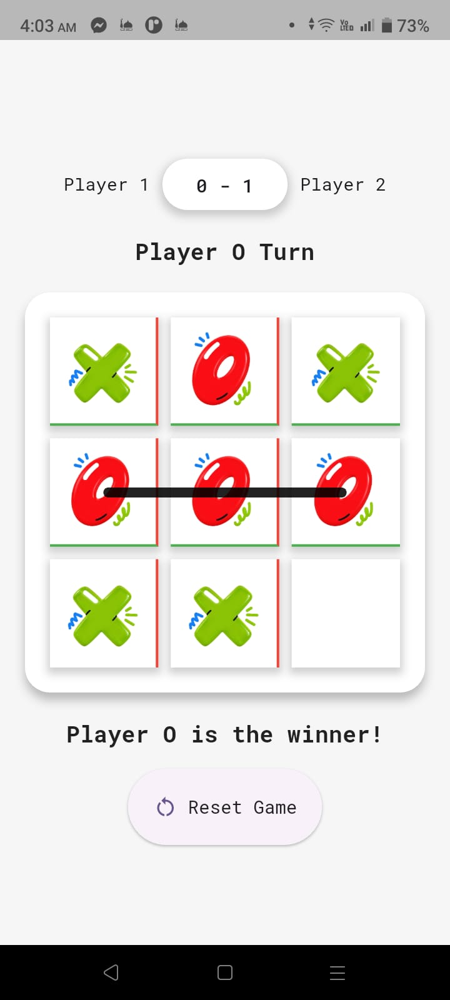
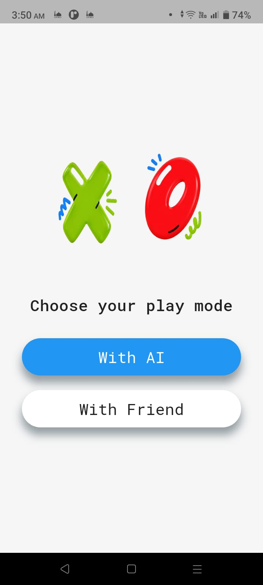
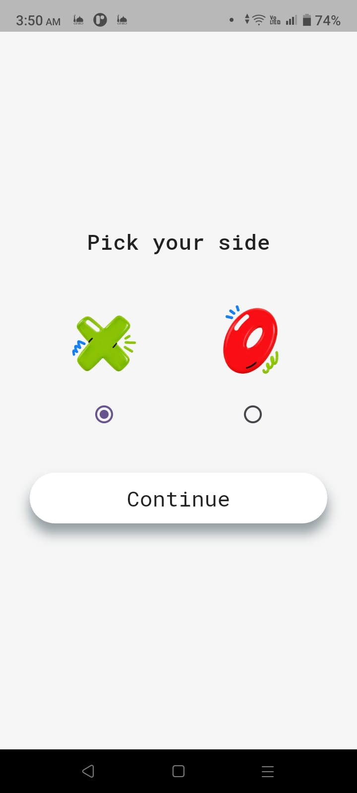
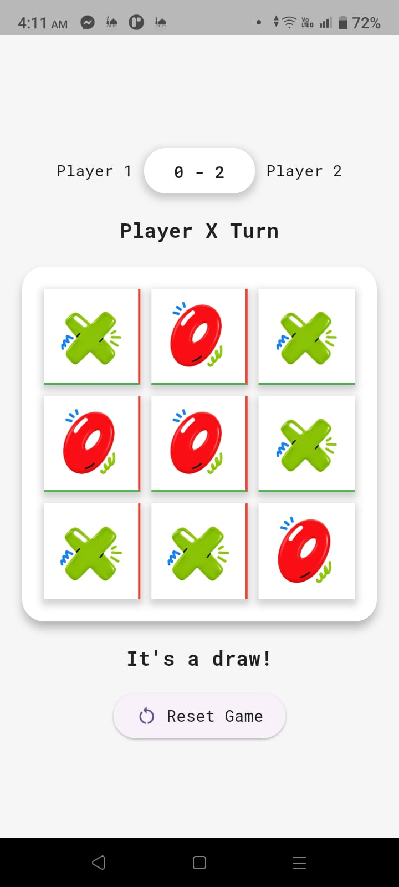

<p align="center">
  
</p>

<h1 align="center">Tic Tac Toe</h1>

<p align="center">
  A simple and interactive Tic Tac Toe game built with Flutter.
</p>

<p align="center">
  Play against a friend or challenge an AI opponent.
</p>

--------------------------

## 🎮 About the Project

Tic Tac Toe is a simple and interactive Flutter game that allows players to enjoy the classic Tic Tac Toe experience either against a friend or an AI opponent.

The game provides a simple flow where players can:

* Choose their preferred game mode.
* Select their playing side (X or O).
* Start playing immediately.
* Get visual feedback when a winning pattern is detected.

When a player wins, the winning pattern is highlighted using a custom-painted line, accompanied by a celebration effect using the **Confetti** package.

---------------------------

## ✨ Features

* **Game Modes** — Play against a friend or an AI opponent.
* **Player Side Selection** — Choose to play as X or O.
* **Interactive Gameplay** — Simple and responsive game experience.
* **Winning Pattern Detection** — Automatically detects winning combinations.
* **Custom Winning Line** — Uses Flutter's `CustomPainter` to draw a line over the winning pattern.
* **Win Celebration** — Displays a celebration animation using the `Confetti` package.
* **Draw Detection** — Detects when the game ends without a winner.
* **Reusable Widgets** — UI components are organized into reusable widgets.
* **Responsive UI** — Designed to work across different screen sizes.

------------------------------------

## 🎯 Game Flow

### 1. Select Play Mode

The player first chooses how they want to play:

* **Play with a Friend**
* **Play with AI**

### 2. Select Your Side

The player chooses which side they want to play:

* **X**
* **O**

### 3. Start the Game

The game board is displayed and the player can start playing.

When a winning pattern is detected:

1. The winning combination is identified.
2. A line is drawn over the winning pattern using `CustomPainter`.
3. A celebration animation is displayed using `Confetti`.

If all cells are filled without a winning combination, the game displays a **Draw** result.

-------------------------------------

## 🛠️ Tech Stack

| Technology           | Usage                                    |
| -------------------- | ---------------------------------------- |
| **Flutter**          | Application development                  |
| **Dart**             | Game logic and application code          |
| **Flutter Widgets**  | User interface                           |
| **CustomPainter**    | Drawing the winning line                 |
| **Confetti**         | Win celebration animation                |
| **Local Game Logic** | Game state and winning pattern detection |

---

## 📁 Project Structure

```text
lib/
│
├── core/
│   ├── app_colors.dart
│   ├── app_images.dart
│   └── text_styles.dart
│
├── logic/
│   └── game_logic.dart
│
├── views/
│   ├── widgets/
│   │
│   ├── game_home.dart
│   ├── select_play_mode.dart
│   └── select_your_side.dart
│
└── main.dart
```

### Core

The `core` folder contains shared resources used throughout the application:

* `app_colors.dart` — Contains the application's color definitions.
* `app_images.dart` — Contains image-related constants and resources.
* `text_styles.dart` — Contains reusable text styles.

### Logic

The `logic` folder contains the application's game logic:

* `game_logic.dart` — Handles the main Tic Tac Toe game logic, game state, and winning patterns.

### Views

The `views` folder contains the application's screens and reusable UI components:

* `game_home.dart` — Main game screen.
* `select_play_mode.dart` — Allows the player to choose between playing with a friend or AI.
* `select_your_side.dart` — Allows the player to select X or O.
* `widgets/` — Contains reusable UI components used throughout the game.

### Main

* `main.dart` — The entry point of the Flutter application.

---------------------------

## 📸 Screenshots

### Select Play Mode

<p align="center">
  
</p>

### Choose Your Side

<p align="center">
  
</p>

### Game & Winning Result

<p align="center">
  
</p>

### Draw Result

<p align="center">
  
</p>

----------------------------

## 🎥 Demo Video

<p align="center">
  <a href="https://drive.google.com/file/d/16Rwg74piT8Pbw_F5LC2kq_Ubw0aGmqZK/view?usp=drive_link">
    Watch the Tic Tac Toe Demo
  </a>
</p>

------------------------------

## 📦 Packages Used

### 🎉 UI & Animation

* **Confetti** — Used to display a celebration animation when a player wins.

### 🎨 Flutter Features

* **CustomPainter** — Used to draw the winning line over the detected winning pattern.
* **Flutter Widgets** — Used to build the game's user interface and interactions.

---------------------------------

## 🚀 Getting Started

### Prerequisites

Before running the project, make sure you have:

* Flutter SDK installed.
* Dart SDK installed.
* Android Studio or Visual Studio Code.
* An Android emulator, iOS simulator, or a physical device.

### Installation

1. Clone the repository:

```bash
git clone <your-repository-url>
```

2. Navigate to the project directory:

```bash
cd <project-folder>
```

3. Install the dependencies:

```bash
flutter pub get
```

4. Run the application:

```bash
flutter run
```

---

## 🎮 How to Play

1. Open the application.
2. Select the preferred game mode:

   * **Play with a Friend**
   * **Play with AI**
3. Select your side:

   * **X**
   * **O**
4. Start playing Tic Tac Toe.
5. Complete a winning pattern to win the game.
6. The winning pattern will be highlighted with a custom-drawn line.
7. A celebration animation will appear when a player wins.
8. If all cells are filled without a winner, the game ends in a draw.

----------------------

## 💡 Highlights

This project demonstrates:

* Flutter UI development.
* Game logic implementation.
* Winning pattern detection.
* Custom drawing using `CustomPainter`.
* Reusable widget development.
* Basic animation and visual feedback.
* Responsive UI design.

---------------------------

## 👩‍💻 Author

**Noura Tarek**

Flutter Developer | Software Engineer

---
